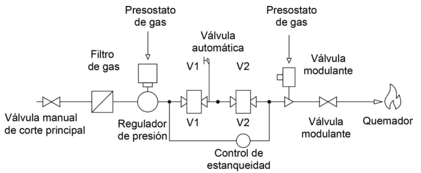

<!-- *** GUIDE START *** -->

## 1. Instalación para un horno indutrial [⌕](../../images/gas/horno_trat_termico_caltec.png) 

El objetivo es mostrar los pasos para dimensionar analíticamente la cañería de alimentación para un horno industrial grande, garantizando seguridad, presión adecuada y velocidades dentro de norma.

Los datos iniciales son:

- Se trata de un horno industrial grande que trabaja con gas natural
- **$C_m$,** consumo medio en condiciones normales: 500.000 NKcal/h
- **$L$**, longitud real de la cañería desde la Planta de Regulación y Medición Primaria (PRMP) hasta el horno: 30 m  [⌕](../../images/gas/inst_industrial_componentes.png)
- Presión del gas a la salida de la Planta de Regulación y Medición Primaria (PRMP): 0,5 bar manométricos. [⌕](../../images/gas/industrial-design-pressure-absolute-vs-gauge.png)

::: note

**Condiciones normales:** En indutria consumo y caudal se diseñan y calculan para conciones normales que según la norma corresponden a 15 °C y 101,325 KPa (1,01325 bar = 1 atm) 

:::

## 2. Definición de la Carga Térmica y el Caudal (Q)

El primer paso es conocer cuánta energía requiere el horno. El cálculo del caudal se realiza bajo **Condiciones Normales** y se indica como (Nm³/h).

Se aplica la misma fórmula que aplicamos para calcular el consumo de una estufa:

$Q = \frac{C_m}{PCS}$

donde:

- $Cm$: Consumo medio en condiciones normales en Kcal/h.
- $PCS$: Poder calorífico superior del gas. Es el que pide usar la norma y esta además estipula su valor en $9300 \text{ kcal/m}^3$ 

::: example

**Cálculo:** 

$Q = \frac{500.000 \text{ kcal/h}}{9.300 \text{ kcal/m}^3} \approx \mathbf{53,76 \text{ Nm}^3/h}$.

:::

::: note

**Nota:** En industria, si hay varios hornos, se suman sus consumos nominales directamente, asumiendo simultaneidad total para el proceso productivo. En cambio en instalaciones domiciliarias es válido aplicar un coeficiente de simultaneidad para componer los diferentes consumos.

:::

## 3. Esquema y Longitud Equivalente (Le)

Se debe trazar el recorrido de la cañería desde la **Planta de Regulación y Medición Primaria (PRMP)** hasta el horno. Este camino puede tener subidas, bajadas, cambios de dirección, etc.

Para compensar la pérdida de carga de accesorios (codos, válvulas), la norma simplifica el cálculo incrementando la longitud real (L) en un **20%**.

::: example

**Cálculo:**

*   Longitud real (L): 30 metros.
*   **Cálculo:** $L_e = 30 \cdot 1,2 = \mathbf{36 \text{ metros}}$.

:::

## 4. Cálculo del diámetro interior teórico $d$ (Renouard)

La norma establece un límite técnico en los **100 mbar** para decidir cómo se calcula una instalación interna. Dependiendo de la presión de operación, elegiremos una de las dos fórmulas de Renouard admitidas:

### Caso A (presión de operación $\le 100 \text{mbar}$)

Usamos la fórmula de **Renouard Lineal**:

$$\Delta P = 23200 \cdot \delta \cdot L_e \cdot Q^{1,82} \cdot d^{-4,82}$$

Donde:

*   $\Delta P$: Caída de presión en $\text{mbar}$.
*   d: Diámetro interior en mm.
*   $\delta$: Densidad relativa (0,65 para GN).

### Caso B: (presión $> 100 \text{mbar}$)

Usamos la fórmula de **Renouard cuadrática**:

$$P_A^2 - P_B^2 = 48,6 \cdot \delta \cdot L_e \cdot Q^{1,82} \cdot d^{-4,82}$$

**Donde:**

*   **$P_A, P_B$:** Presiones absolutas al inicio y final del tramo en $\text{bar A}$ (bar A = Presión manométrica en bar + 1,01325).
*   **Caudal Q:** Se expresa en **$Nm^3/h$** (metros cúbicos normales por hora)
*   **Densidad relativa $\delta$** Es una magnitud **adimensional** (relación respecto al aire). Para el Gas Natural, se adopta el valor de **0,65**.
*   **Longitud equivalente $L_e$:** Se mide en **metros (m)**.
*   **Diámetro $d$:** diámetro interior de la cañería expresado en **milímetros (mm)**.
*   **48,6** es una constante numérica propia de la fórmula para que el resultado de la diferencia de cuadrados sea consistente con las unidades mencionadas.

### Cálculo aplicado al horno de nuestro ejemplo

Como la presión es 0,5 bar (500 mbar) se aplica Renouard cuadrática y de esta formula despejamos el diámetro que queda:

$d = \left( \frac{48,6 \cdot \delta \cdot L_e \cdot Q^{1,82}}{P_A^2 - P_B^2} \right)^{0,2075}$

Donde:

*   $Q$: $53,76 \text{ Nm}^3/\text{h}$
*   $\delta$: 0,65
*   $L_e$: $36 \text{ metros}$
*   **Presión al inicio del tramo $P_A$:** $0,5 \text{ bar}$ manométricos. Pasamos a presión absoluta: $P_A = 0,5 + 1,01325 = \mathbf{1,51325 \text{ bar A}}$.
*   **Presión al final del tramo $P_B$:** La norma industrial permite una caída de presión máxima (típicamente del 10% en tramos de alimentación a equipos). Si perdemos $0,05 \text{ bar}$: $P_B = 0,45 + 1,01325 = \mathbf{1,46325 \text{ bar A}}$.

::: example

**Poniendo los datos del ejemplo queda:**

$d = \left( \frac{48,6 \cdot \delta \cdot L_e \cdot Q^{1,82}}{1,51325^2 - 1.46325^2} \right)^{0,2075}$

**Resultado:** $\approx \mathbf{28,79 \text{ mm}}$

:::

## 5. De lo Teórico a lo Comercial

Con el valor teórico de **28,79 mm**, debemos ir a la **Tabla E.2 [⌕](../../images/gas/industrial-design-tabla-e2-caños.png)** de dimensiones de caños de acero (NAG-250) incluida en la norma NAG-200:

*   El diámetro nominal de **25 mm (1")** tiene un interior real de **27,9 mm**. (Es menor al necesario).
*   El diámetro nominal de **32 mm (1 ¼")** tiene un interior real de **36,6 mm**.

**Decisión:** Se debe adoptar el diámetro nominal de **32 mm (1 ¼")**, ya que su capacidad física es superior al requerimi|ento analítico calculado.

## 6. Verificaciones Obligatorias

### A. Recálculo de Pérdida de Carga Real

Con el diámetro de 36,6 mm, real, se debe verificar que la presión final (P_B) en el tren de válvulas del horno sea suficiente para su funcionamiento (típicamente no debe perderse más del 10% de la presión de entrada en media presión).

### B. Verificación de Velocidad (V)

Es fundamental para evitar ruidos y vibraciones. Se usa la fórmula:

$$V = 358,36 \cdot \frac{Q}{d^2 \cdot P}$$

**Límites NAG-201:**

*   En Planta de Regulación y Medición Primaria (PRMP): **$< 25 \text{ m/s}$**.
*   En cañerías internas: **$< 40 \text{ m/s}$**.

::: example

$V = 358,36 \cdot \frac{53,76}{36,6^2 \cdot 1,46325} \approx \mathbf{9,82 \text{ m/s}}$

Como **$9,82 < 40$**, el diseño es **seguro y reglamentario**.

:::

## 7. El Tren de Válvulas del Horno

El gas no entra directo al horno; requiere un **tren de válvulas** de seguridad. Según la NAG-201 y ejemplos típicos:

1.  **Válvula manual de corte principal.**
2.  **Filtro de gas** (para partículas $> 80$ micrones).
3.  **Regulador de presión** (si el equipo trabaja a menor presión que la línea).
4.  **Dos válvulas automáticas de cierre rápido** en serie (V1 y V2).
5.  **Presostatos** de mínima y máxima presión de gas.
6.  **Sistema de detección de llama** (electrodos o UV).

::: figure
{width=600px}

<small>Ejemplo típico de un tren de válvulas (NAG-201 7.7.12)</small>
:::

## 8. Documentación Técnica

Un **Instalador Matriculado de Primera** debe presentar:

*   **Plano de la instalación** con isométrico acotado.
*   **Memoria de cálculo** de diámetros y ventilaciones.
*   **Planilla de consulta previa** indicando caudales máximos y futuros.

poner una caldera como ejemplo de otro equipo industrial, quizás agregarlo en el tp

<!-- *** GUIDE END *** -->

<!-- *** GUIDE AUXILIARY THINGS *** -->

<!--

● Sections: example, activity. solutions, figure, warning, note

::: example
### Ejemplo: Cálculo de derivadas
Aquí va el contenido de tu ejemplo. Puedes usar Markdown normal adentro.
:::

● Image:

::: figure
{width=400px}

<small>Pie (Source)</small>
:::

[⌕](../../images/ ) 

● Videos:

 Change XXX to video-id and put time in seconds

 - Yotube with start point: [Mira este momento clave en el video](https://www.youtube.com/watch?v=XXX&t=123s)

 - Youtubetrimmer with start and end point: [Mirá este momento puntual del video](https://youtubetrimmer.com/view/?v=XXX&start=120&end=150&loop=0)

-->
