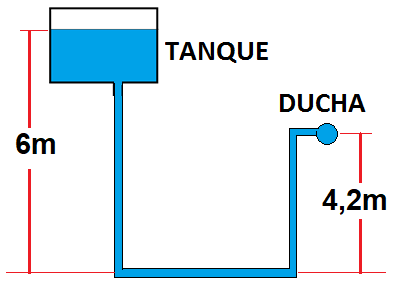
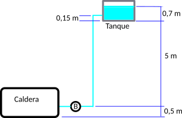

Quiz title: Cálculo de la presión

1. Calcular la presión hidrostática en la ducha en Kgf/cm2. (Equivalencia: 1 Kgf/cm2 = 10 mca) 
= 0.18 +- 0.01

2. Se trata de un tanque de agua que alimenta una caldera. Calcular la presión hidrostática en el punto "B" a la entrada de la caldera en en Bares. (Equivalencia: 1 kgf/cm² ≈ 0,9807 bar) 
= 0.55 +- 0.05

3. No escribas nada aquí. Sirve para registrar la parte oral.
... Explica como hiciste los problemas.
____
